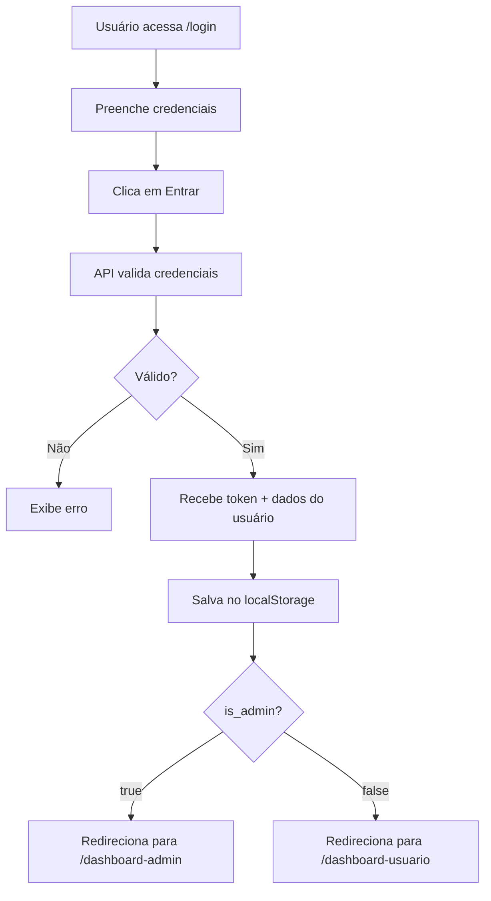

# 🔐 Sistema de Autenticação - VibeGet

## ✅ Implementação Concluída

O sistema de autenticação foi completamente implementado e integrado com a API Laravel.

---

## 🎯 Funcionalidades Implementadas

### 1. **Serviço de API** (`src/services/api.js`)
- ✅ Configuração do Axios com interceptors
- ✅ Adição automática de token JWT em requisições
- ✅ Tratamento de erros 401 (não autorizado)
- ✅ Serviços de autenticação (login, registro, logout, etc.)
- ✅ Gerenciamento de tokens no localStorage

### 2. **Contexto de Autenticação** (`src/contexts/AuthContext.js`)
- ✅ Estado global de autenticação
- ✅ Verificação automática de token ao carregar
- ✅ Funções de login, logout e registro
- ✅ Gerenciamento de dados do usuário
- ✅ Hook `useAuth()` para acesso fácil

### 3. **Componente de Rota Protegida** (`src/components/ProtectedRoute.js`)
- ✅ Proteção de rotas que requerem autenticação
- ✅ Proteção de rotas exclusivas para admin
- ✅ Redirecionamento automático para login
- ✅ Tela de loading durante verificação

### 4. **Página de Login Atualizada** (`src/pages/Login.js`)
- ✅ Integração com API Laravel
- ✅ Validação de credenciais
- ✅ Exibição de mensagens de erro
- ✅ Loading state durante autenticação
- ✅ **Redirecionamento baseado em `is_admin`:**
  - Admin (`is_admin=1`) → `/dashboard-admin`
  - Usuário (`is_admin=0`) → `/dashboard-usuario`

### 5. **App.js Atualizado**
- ✅ AuthProvider envolvendo toda aplicação
- ✅ Todas as rotas de dashboard protegidas
- ✅ Rotas admin com proteção adicional

---

## 🚀 Como Usar

### Login como Usuário Normal

1. Acesse: http://localhost:3000/login
2. Use as credenciais:
   ```
   Email: usuario@teste.com
   Senha: teste123
   ```
3. Será redirecionado para: http://localhost:3000/dashboard-usuario

### Login como Administrador

1. Acesse: http://localhost:3000/login
2. Use as credenciais:
   ```
   Email: admin@vibeget.com
   Senha: admin123
   ```
3. Será redirecionado para: http://localhost:3000/dashboard-admin

---

## 🔒 Rotas Protegidas

### Rotas de Usuário (requerem autenticação)
- `/dashboard-usuario`
- `/dashboard-usuario/minha-conta`
- `/dashboard-usuario/meus-lances`
- `/dashboard-usuario/meu-cashback`

### Rotas de Admin (requerem autenticação + is_admin=1)
- `/dashboard-admin`
- `/dashboard-admin/usuarios`
- `/dashboard-admin/produtos`
- `/dashboard-admin/leiloes`
- `/dashboard-admin/lances`
- `/dashboard-admin/cashback`
- `/dashboard-admin/transacoes`
- `/dashboard-admin/relatorios`

---

## 📡 Fluxo de Autenticação



---

## 🛠️ Como Funciona

### 1. Login
```javascript
import { useAuth } from '../contexts/AuthContext';

const { login } = useAuth();

const handleLogin = async () => {
  const result = await login(email, password);
  if (result.success) {
    // Redireciona baseado em result.user.is_admin
    if (result.user.is_admin) {
      navigate('/dashboard-admin');
    } else {
      navigate('/dashboard-usuario');
    }
  }
};
```

### 2. Verificar se está autenticado
```javascript
import { useAuth } from '../contexts/AuthContext';

const { isAuthenticated, user, isAdmin } = useAuth();

if (isAuthenticated) {
  console.log('Usuário:', user);
  console.log('É admin?', isAdmin);
}
```

### 3. Logout
```javascript
import { useAuth } from '../contexts/AuthContext';

const { logout } = useAuth();

const handleLogout = async () => {
  await logout();
  navigate('/login');
};
```

### 4. Proteger uma rota
```javascript
import ProtectedRoute from './components/ProtectedRoute';

// Rota que requer autenticação
<Route path="/dashboard-usuario" element={
  <ProtectedRoute>
    <DashboardUsuario />
  </ProtectedRoute>
} />

// Rota que requer ser admin
<Route path="/dashboard-admin" element={
  <ProtectedRoute adminOnly={true}>
    <DashboardAdmin />
  </ProtectedRoute>
} />
```

---

## 🔄 Persistência de Autenticação

O sistema mantém o usuário autenticado mesmo após recarregar a página:

1. **Token JWT** é armazenado no `localStorage`
2. **Dados do usuário** são armazenados no `localStorage`
3. Ao carregar a aplicação, o `AuthContext` verifica se existe token
4. Se existir, valida o token com a API
5. Se válido, restaura o estado de autenticação

---

## 🔐 Segurança

### Token JWT
- Armazenado no localStorage
- Adicionado automaticamente em todas requisições (header Authorization)
- Removido automaticamente ao fazer logout
- Validado pela API em cada requisição

### Tratamento de Erros
- Erro 401 → Remove token e redireciona para login
- Token expirado → Logout automático
- Credenciais inválidas → Exibe mensagem de erro

---

## 📝 Exemplo Completo de Uso

```javascript
import React, { useState } from 'react';
import { useNavigate } from 'react-router-dom';
import { useAuth } from '../contexts/AuthContext';

const MeuComponente = () => {
  const { user, isAuthenticated, isAdmin, logout } = useAuth();
  const navigate = useNavigate();

  if (!isAuthenticated) {
    return <div>Você precisa fazer login</div>;
  }

  const handleLogout = async () => {
    await logout();
    navigate('/login');
  };

  return (
    <div>
      <h1>Olá, {user.name}!</h1>
      <p>Email: {user.email}</p>
      <p>Saldo: R$ {user.balance}</p>
      <p>Cashback: R$ {user.cashback_balance}</p>
      {isAdmin && <p>Você é administrador!</p>}
      <button onClick={handleLogout}>Sair</button>
    </div>
  );
};
```

---

## 🧪 Testando

### 1. Testar Login de Usuário
```bash
# Acesse
http://localhost:3000/login

# Login com
Email: usuario@teste.com
Senha: teste123

# Deve redirecionar para
http://localhost:3000/dashboard-usuario
```

### 2. Testar Login de Admin
```bash
# Acesse
http://localhost:3000/login

# Login com
Email: admin@vibeget.com
Senha: admin123

# Deve redirecionar para
http://localhost:3000/dashboard-admin
```

### 3. Testar Proteção de Rotas
```bash
# Sem estar logado, tente acessar
http://localhost:3000/dashboard-usuario

# Deve redirecionar para
http://localhost:3000/login
```

### 4. Testar Logout
```bash
# Após fazer login, clique em "Sair"
# Deve voltar para a página inicial ou login
```

---

## ✨ Próximos Passos

1. ✅ Autenticação implementada
2. ✅ Redirecionamento baseado em is_admin
3. ✅ Proteção de rotas
4. 📋 Implementar página de registro com integração à API
5. 📋 Implementar recuperação de senha
6. 📋 Adicionar atualização de perfil
7. 📋 Implementar alteração de senha
8. 📋 Adicionar notificações de sucesso/erro
9. 📋 Implementar refresh token

---

## 🎉 Status

**✅ Sistema de Autenticação Totalmente Funcional!**

- Login funcionando ✅
- Logout funcionando ✅
- Proteção de rotas ✅
- Redirecionamento baseado em is_admin ✅
- Persistência de sessão ✅
- Integração com API Laravel ✅

---

**Data de Implementação:** 18/12/2024
**Desenvolvido para:** VibeGet - Leilões Online com Cashback

